# Diagrama de Base de Datos — WebMultiempresaDemo

> Última actualización: 2026-05-20
>
> **Leyenda de colores (por sección):**
> - 🟦 Tablas nuevas creadas por EF Core (gestionadas por migraciones)
> - 🟥 Tablas legacy del sistema ERP existente (ExcludeFromMigrations — solo lectura)

---

## ERD — Diagrama de entidad-relación

```mermaid
erDiagram

    %% ── CORE ──────────────────────────────────────────────────
    Empresas {
        int     EmpresaID   PK
        nvarchar Nombre
        nvarchar KeyConexion "UNIQUE"
        bit     Baja
    }

    Usuarios {
        int     UsuariosID  PK
        int     EmpresaID   FK
        nvarchar Email       "UNIQUE"
        nvarchar PasswordHash
        nvarchar Nombre
        tinyint Rol
        bit     Baja
        datetime2 FechaCreacion
    }

    %% ── CATÁLOGOS ─────────────────────────────────────────────
    Rubros {
        int     RubrosID    PK
        int     EmpresaID   FK
        nvarchar Nombre
        bit     Baja
    }

    Marcas {
        int     MarcasID    PK
        int     EmpresaID   FK
        nvarchar Nombre
        bit     Baja
    }

    ListasPrecios {
        int     ListasPreciosID PK
        int     EmpresaID       FK
        nvarchar Nombre
        bit     Baja
    }

    Sucursales {
        int     SucursalesID PK
        int     EmpresaID    FK
        nvarchar Nombre
        bit     Baja
    }

    %% ── COMBOS ────────────────────────────────────────────────
    Combos {
        int     CombosID              PK
        int     EmpresaID             FK
        int     RubrosID              FK
        nvarchar Nombre
        nvarchar NombreAlternativo
        nvarchar Codigo               "UNIQUE por empresa"
        int     Cantidad
        int     CantidadFacturada     "readonly — calculado por ERP"
        decimal CantidadPorFactura
        decimal CantidadDinamica
        int     CantidadDinamicaMaxima
        decimal CantidadSinCargo      "Sin Cargos FIJOS"
        decimal CantidadXPDV          "Cantidad por PDV/cliente"
        decimal MontoArrastre         "Monto mínimo arrastre ($)"
        decimal ImporteProductosFuera
        decimal PorcentajeComision
        nvarchar Nota
        datetime2 FechaInicio
        datetime2 FechaVigencia
        bit     TomaProdParaArrastre  "requiere compra de rubros/marcas arrastre"
        bit     TodosLosVendedores
        bit     TodasLasListasPrecios
        bit     TodasLasSucursales
        bit     ClientesNumericos
        bit     ClientesAlfaNumericos
        bit     EsEstrategico
        bit     SoloNoCompradores
        datetime2 SoloNoCompradoresDesde
        bit     ComboDinamico
        bit     EsDeIntroduccion
        bit     NoImprimir
        bit     ImpresionResumida
        bit     UsarDescuentoClientes
        bit     ValidarPartido
        int     CupoTotal
        bit     Baja
        datetime2 FechaCreacion
    }

    ComboItems {
        int     ComboItemsID PK
        int     CombosID     FK
        int     ProductosID  FK "→ Productos.ProductosID"
        decimal Cantidad
        decimal Precio
        tinyint Tipo         "1=ConCargo · 2=SinCargo · 3=SinCargoFijo"
        decimal Descuento1
        decimal Descuento2
        int     NroGrupoDinamico
    }

    ComboFechas {
        int     ComboFechasID PK
        int     CombosID      FK
        datetime2 FechaInicial
        datetime2 FechaFinal
    }

    ComboVendedores {
        int ComboVendedorID PK
        int CombosID        FK
        int VendedoresID    FK "→ Vendedores.VendedoresID"
    }

    ComboListasPrecios {
        int ComboListaPreciosID PK
        int CombosID            FK
        int ListasPreciosID     FK
    }

    ComboSucursales {
        int ComboSucursalID PK
        int CombosID        FK
        int SucursalesID    FK
    }

    ComboRubros {
        int ComboRubrosID PK
        int CombosID      FK
        int RubrosID      FK "UNIQUE(CombosID, RubrosID)"
    }

    ComboMarcas {
        int ComboMarcasID PK
        int CombosID      FK
        int MarcasID      FK "UNIQUE(CombosID, MarcasID)"
    }

    ComboLogs {
        int       ComboLogsID    PK
        int       CombosID       FK
        int       EmpresaID      FK
        int       UsuariosID     FK
        nvarchar  NombreUsuario  "snapshot del nombre"
        nvarchar  PC             "origen: siempre Web"
        nvarchar  Comentario
        datetime2 Fecha
    }

    %% ── LEGACY (solo lectura desde la webapp) ─────────────────
    Productos {
        int     ProductosID PK
        int     ProductosID
        varchar CodigoDeProducto        "mapped as: Codigo"
        nvarchar Nombre
        int     Orden
        bit     DesactivadoParaLaVenta
        nvarchar Rubro
        nvarchar Marca
        int     UnidadesPorBulto
        decimal PrecioUnitarioFinalL1
        decimal PrecioUnitarioFinalL2
        decimal PrecioUnitarioFinalL3
        decimal PrecioUnitarioFinalL8   "...L4-L8"
        decimal PrecioUnitarioNetoL1
        decimal PrecioUnitarioNetoL8    "...L2-L8"
        decimal PorcentajeDeIva
        bit     Baja
        int     EmpresaID
    }

    Vendedores {
        int     VendedoresID PK
        int     VendedorID
        varchar CodigoDelVendedor        "mapped as: Codigo"
        varchar NombreDelVendedor        "mapped as: Nombre"
        int     TiposDeVendedoresID
        bit     Autogestion
        decimal CoheficienteComision
        bit     EsPago
        int     EmpresaID
        bit     Baja
        varchar WhatsApp
    }

    Clientes {
        int     ClientesID PK
        int     ClientesID
        nvarchar Codigo
        nvarchar Nombre
        nvarchar Direccion
        nvarchar Localidad
        nvarchar Provincia
        nvarchar Telefono
        nvarchar Email
        nvarchar Cuit
        int     ListaDePrecio
        int     VendedoresId
        int     VendedoresId2
        int     VendedoresId3
        int     VendedoresId4
        decimal Latitud
        decimal Longitud
        int     EmpresaID
    }

    PedidosJson {
        int     PedidosJsonID PK
        int     EmpresaID
        varchar JsonPedido                "varchar(max)"
        datetime2 HoraGuardada
        datetime2 HoraDescargada
    }

    %% ── RELACIONES ────────────────────────────────────────────

    Empresas ||--o{ Usuarios        : "tiene"
    Empresas ||--o{ Rubros          : "tiene"
    Empresas ||--o{ Marcas          : "tiene"
    Empresas ||--o{ ListasPrecios   : "tiene"
    Empresas ||--o{ Sucursales      : "tiene"
    Empresas ||--o{ Combos          : "tiene"

    Rubros    ||--o{ Combos         : "clasifica"

    Combos    ||--o{ ComboItems         : "contiene"
    Combos    ||--o{ ComboFechas        : "tiene"
    Combos    ||--o{ ComboVendedores    : "asignado a"
    Combos    ||--o{ ComboListasPrecios : "asignado a"
    Combos    ||--o{ ComboSucursales    : "asignado a"
    Combos    ||--o{ ComboRubros        : "arrastre rubros"
    Combos    ||--o{ ComboMarcas        : "arrastre marcas"
    Combos    ||--o{ ComboLogs          : "historial"

    Productos       ||--o{ ComboItems         : "incluido en"
    Vendedores      ||--o{ ComboVendedores    : "habilitado en"
    ListasPrecios   ||--o{ ComboListasPrecios : "habilitada en"
    Sucursales      ||--o{ ComboSucursales    : "habilitada en"
    Rubros          ||--o{ ComboRubros        : "arrastre en"
    Marcas          ||--o{ ComboMarcas        : "arrastre en"
```

---

## Tablas nuevas — creadas por EF Core 🟦

Todas con sufijo lowercase `multiempresa`. Gestionadas por migraciones EF.

| Tabla | Filas clave | Descripción |
|---|---|---|
| `Empresas` | EmpresaID, KeyConexion | Tenant raíz. Todos los demás datos se filtran por EmpresaID |
| `Usuarios` | UsuariosID, EmpresaID, Email, Rol | Usuarios de la webapp. Rol 0 = SuperAdmin, 1 = Admin |
| `Rubros` | RubrosID, EmpresaID | Categorías de combos, por empresa |
| `Marcas` | MarcasID, EmpresaID | Marcas de productos, por empresa |
| `ListasPrecios` | ListasPreciosID, EmpresaID | Listas de precios disponibles por empresa |
| `Sucursales` | SucursalesID, EmpresaID | Sucursales de la empresa |
| `Combos` | CombosID, EmpresaID, RubrosID, Codigo | Combo principal. Código único por empresa |
| `ComboItems` | ComboItemsID, CombosID, ProductosID | Productos que componen un combo (FK → legacy) |
| `ComboFechas` | ComboFechasID, CombosID | Períodos de vigencia asignados al combo |
| `ComboVendedores` | ComboVendedorID, CombosID, VendedoresID | N:M — combo habilitado para vendedor (FK → legacy) |
| `ComboListasPrecios` | ComboListaPreciosID, CombosID, ListasPreciosID | N:M — combo habilitado para lista de precios |
| `ComboSucursales` | ComboSucursalID, CombosID, SucursalesID | N:M — combo habilitado en sucursal |
| `ComboRubros` | ComboRubrosID, CombosID, RubrosID | N:M — rubros (proveedores) requeridos para validar arrastre |
| `ComboMarcas` | ComboMarcasID, CombosID, MarcasID | N:M — marcas (familias) requeridas para validar arrastre |
| `ComboLogs` | ComboLogsID, CombosID, EmpresaID, UsuariosID | Historial de cambios. PC siempre = "Web". GQF por EmpresaID |

---

## Tablas legacy — solo lectura desde la webapp 🟥

Preexistentes en `WebMultiempresaDemo`. **No gestionadas por migraciones EF** (`ExcludeFromMigrations`).
La webapp las consume pero no escribe en ellas (excepto `ComboItems` y `ComboVendedores` que tienen FK hacia ellas).

| Tabla | PK real | Columna mapeada en entidad | Descripción |
|---|---|---|---|
| `Productos` | `ProductosID` | `Producto.ProductosID` | Catálogo de productos del ERP. Contiene precios L1-L8, stock, etc. |
| `Vendedores` | `VendedoresID` | `Vendedor.VendedoresID` | Vendedores del ERP. `NombreDelVendedor` → `Nombre`, `CodigoDelVendedor` → `Codigo` |
| `Clientes` | `ClientesID` | — (sin entidad EF aún) | Clientes del ERP. Referenciados por pedidos móviles |
| `PedidosJson` | `PedidosJsonID` | — (sin entidad EF aún) | Pedidos enviados desde la app móvil en formato JSON. Cola de descarga |

---

## Notas de integración

- **Multi-tenancy:** todos los datos están segmentados por `EmpresaID`. EF Core aplica un Global Query Filter automático en todas las entidades mapeadas.
- **Cross-table FKs:** `ComboItems.ProductosID` → `Productos.ProductosID` y `ComboVendedores.VendedoresID` → `Vendedores.VendedoresID`. Son las únicas FKs que cruzan la frontera nuevas/legacy.
- **Tablas sin cobertura UI aún:** `Clientes` y `PedidosJson` no tienen entidad ni pantallas en la webapp todavía.
- **Soft delete:** todas las tablas usan la columna `Baja bit` para bajas lógicas. No se elimina físicamente ningún registro desde la webapp.
